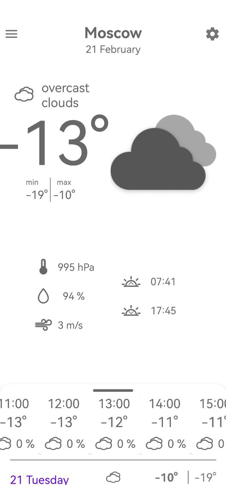
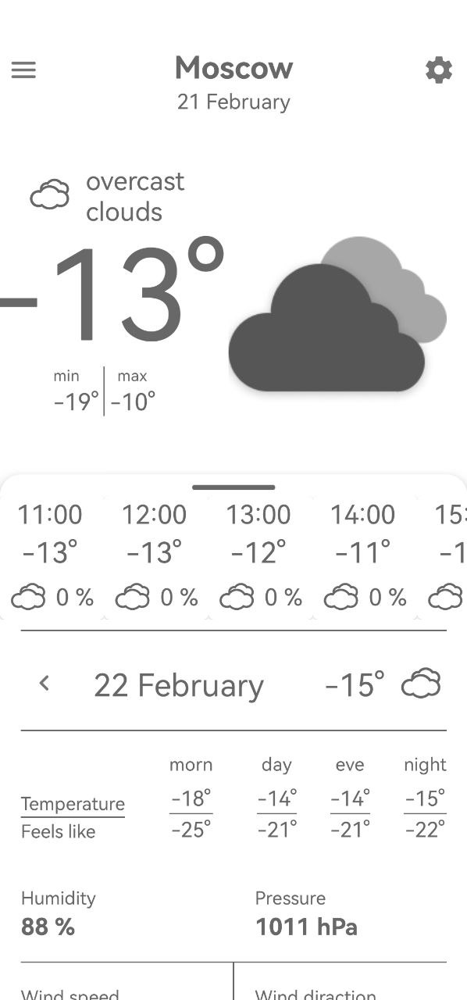
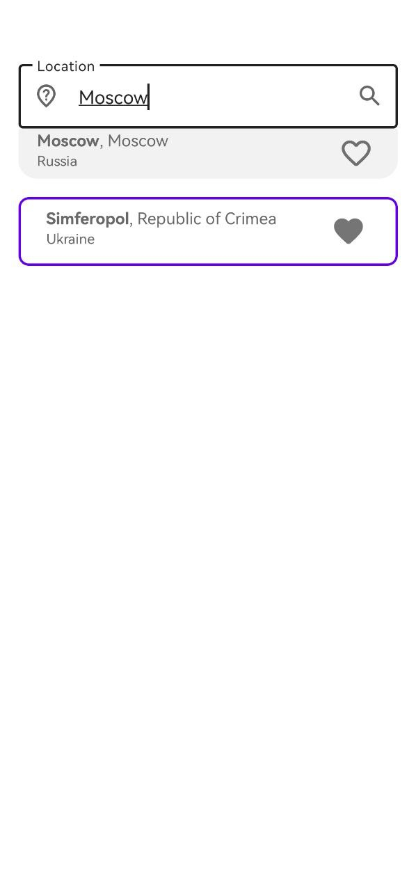

# WeatherApp

## About 

Weather App is an application created to watch weather forecast. In this application you can watch the forecast in the place where you are or search for the city you need.

## Screenshots

    
    
    

 

## Permissons 
- Network access
- Location access

## Technical stack
- Kotlin
- OpenWeatherMap API
- MVP
- Room
- Retofit
- Moxy
- RxJava 3
- ButterKnife
